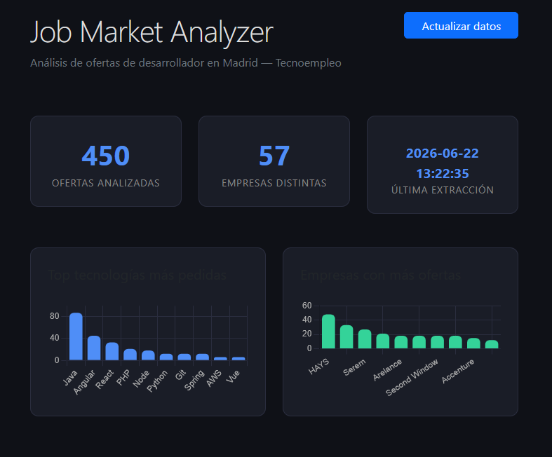

# 📊 Job Market Analyzer

Herramienta que analiza el mercado laboral tech en Madrid scrapeando ofertas reales de [Tecnoempleo](https://www.tecnoempleo.com), procesando los datos con Pandas y visualizándolos en un dashboard web interactivo.

> **¿Por qué lo construí?**
> Como estudiante de DAM buscando mi primer empleo, necesitaba saber qué tecnologías piden realmente las empresas en Madrid — no opiniones de foros, sino datos reales.

---

## 🖥️ Demo



---

## ⚙️ Stack tecnológico

| Capa | Tecnología |
|---|---|
| Scraping | Python + Selenium |
| Almacenamiento | SQLite |
| Análisis | Pandas |
| Web | Flask + Chart.js + Bootstrap 5 |

---

## 📁 Estructura del proyecto

```
Market_Analyzer/
├── scraper/
│   └── Scraper.py        # Selenium → extrae ofertas de Tecnoempleo
├── analysis/
│   └── analyzer.py       # Pandas → estadísticas y tendencias
├── data/
│   └── jobs.db           # Base de datos SQLite (generada al ejecutar)
├── web/
│   ├── app.py            # Servidor Flask + API REST
│   ├── templates/
│   │   └── index.html    # Dashboard
│   └── static/
│       └── charts.js     # Gráficas con Chart.js
└── README.md
```

---

## 🚀 Instalación y uso

### 1. Clona el repositorio

```bash
git clone https://github.com/kevinrashiid/job-market-analyzer.git
cd job-market-analyzer
```

### 2. Instala las dependencias

```bash
pip install selenium webdriver-manager pandas flask
```

### 3. Ejecuta el scraper

```bash
cd scraper
python Scraper.py
```

Esto extrae las ofertas y las guarda en `data/jobs.db`.

### 4. (Opcional) Ejecuta el análisis en consola

```bash
cd analysis
python analyzer.py
```

### 5. Lanza el dashboard web

```bash
cd web
python app.py
```

Abre el navegador en `http://127.0.0.1:5000`

> También puedes pulsar el botón **🔄 Actualizar datos** desde el propio dashboard para relanzar el scraper sin tocar la terminal.

---

## 📈 Resultados (muestra de 150 ofertas)

| Tecnología | Menciones |
|---|---|
| Java | 29 |
| Angular | 15 |
| React | 11 |
| PHP | 7 |
| Node | 6 |
| Python | 4 |
| Git | 4 |
| Spring | 4 |

**Conclusión:** Java sigue dominando el mercado tech en Madrid con el doble de demanda que cualquier framework frontend. El mercado está muy orientado a consultoras (HAYS, Accenture, Michael Page).

---

## 🛣️ Próximas mejoras

- [ ] Filtro por tecnología en el dashboard
- [ ] Histórico de extracciones para ver tendencias en el tiempo
- [ ] Detección automática de nivel de experiencia (junior/senior)
- [ ] Exportar resultados a CSV

---

## 👨‍💻 Autor

**Kevin Rashid Villarroel Mejia** — Estudiante de DAM.

[](https://www.linkedin.com/in/kevin-rashid-villarroel-mejia-1b6b42257/)
[](https://github.com/kevinrashiid)